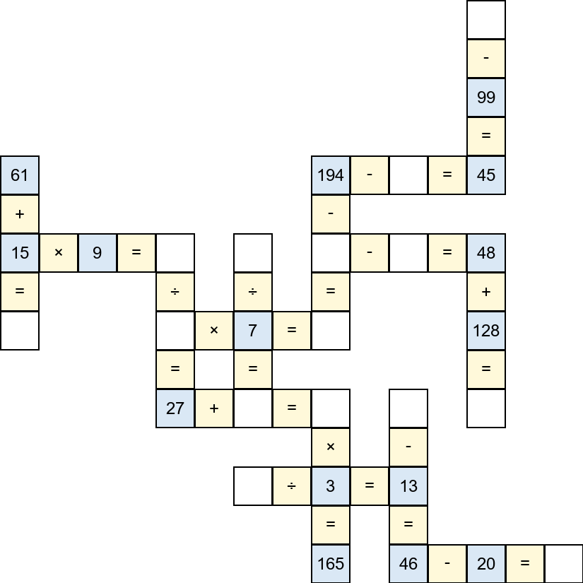

<div align="center">
<h1>CrossMath: Do Vision-Language Models Truly Perform Vision Reasoning? A Rigorous Study of the Modality Gap</h1> 
</div>

<p align="center">
<a href="https://arxiv.org/abs/2604.16256">
  </a>
<br>
<b>Authors:</b>
<a href="https://xuyige.github.io">Yige Xu</a>,
<a href="https://wangyongjie-ntu.github.io">Yongjie Wang</a>, <a>Zizhuo Wu</a>, <a href="https://sites.google.com/site/kaisongsong">Kaisong Song</a>
<a href="https://scholar.google.com/citations?user=DvAsN5QAAAAJ">Jun Lin</a>,
<a href="https://scholar.google.com/citations?user=EA2T_lwAAAAJ">Zhiqi Shen</a>.
</p>


## Overview

*Is there a reasoning gap between textual modality and vision modality in VLMs?* —— We say **Yes**!

We introduce ***CrossMath***, a novel multimodal reasoning benchmark designed for controlled cross-modal comparisons.



## Quick Start

### Setup and Dependencies

Create environments:

```bash
bash build_enviroments.sh --name [Your/env/name]
```

### Prepare Data

The testing data is in ```data/```, which is also available in Huggingface's space with name ```xuyige/CrossMath``` [(here)](https://huggingface.co/datasets/xuyige/CrossMath).

### Evaluation

#### Original Style
For original style, we can use the following command for batch evaluation:
```bash
python batch_inference_qwen35.py \
    --test_file "data/Original/testset_hr.jsonl" \
    --model_name Qwen/Qwen3.5-9B \
    --adapter_dir None \
    --modality image \
    --max_new_tokens 16384 \
    --num_return_sequence 4 \
    --log_suffix "hr"
```
where ```--adapter_dir``` could be applied to load LoRA adapters, ```--modality``` can be selected from ```[image, hybrid, text]```, ```--num_return_sequence``` with generate multiple sequences in parallel, ```--log_suffix "hr"``` saves all predicted answer in file ```hr_run_1.log```, ```hr_run_2.log```, ...


#### Change Image Styles

To change the image style, we can change the following arguments:
<table>
<tr>
    <td><b> Image Style </b></td>
    <td> --test_file </td>
    <td> --log_suffix </td>
</tr>
<tr>
    <td><b> Original Style </b></td>
    <td> data/Original/testset_hr.jsonl </td>
    <td> "hr" </td>
</tr>
<tr>
    <td><b> Without Border </b></td>
    <td> data/Noborder/testset_noborder.jsonl </td>
    <td> "noborder" </td>
</tr>
<tr>
    <td><b>  With Significant Background </b></td>
    <td> data/Beige/testset_hr_beige.jsonl </td>
    <td> "beige" </td>
</tr>
<tr>
    <td><b> Change Font and Color </b></td>
    <td> data/Altstyle/testset_altstyle.jsonl </td>
    <td> "altstyle" </td>
</tr>
</table>

#### Compute Metrics

To compute the evaluation metrics, 

```bash
python calc_metric.py \
    --test_file "data/Original/testset_hr.jsonl" \
    --num_return_sequences 4 \
    --log_suffix "hr"
```
then the script will compute metric according to the logs with the suffix ```"hr"```. For example, will compute metric for log files named ```hr_run_1.log```, ```hr_run_2.log```, ...


## Citation

If you find this work helpful, please cite:
```
@article{xu2026crossmathbench,
	title={Do Vision-Language Models Truly Perform Vision Reasoning? A Rigorous Study of the Modality Gap},
	author={Xu, Yige and Wang, Yongjie and Wu, Zizhuo and Song, Kaisong and Lin, Jun and Shen, Zhiqi},
	journal={arXiv preprint arXiv:2604.16256},
	year={2026}
}
```


